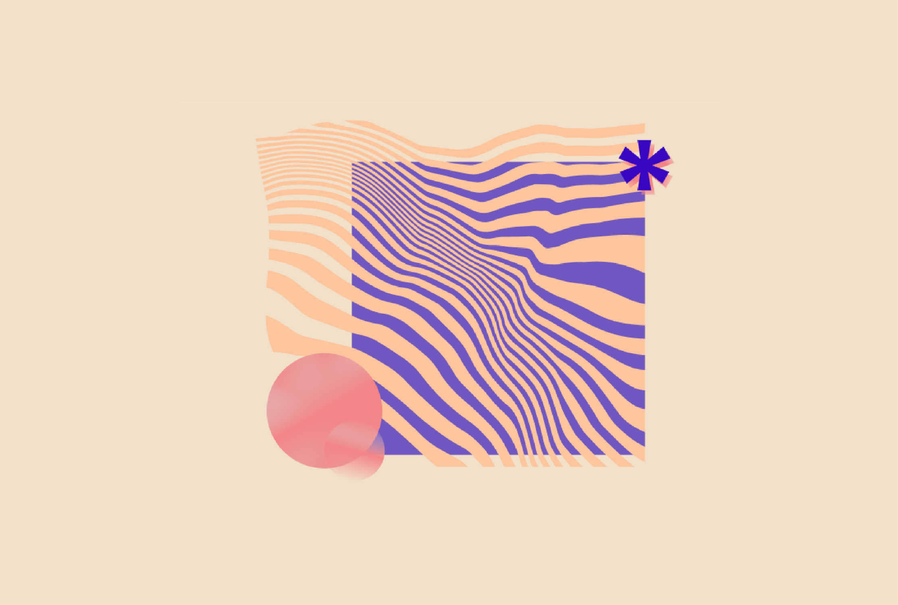

&nbsp;

  

&nbsp;

# Aati Design Shop

**Aati Design** is a graphic design company that creates high-quality, ready-made templates to help businesses with digital marketing. This project is a **WordPress-based** one-page website designed to:
- Showcase Aati Design's products
- Guide customers to platforms where these products can be purchased
Aati Design is currently not operational so feel free to [visit the site here](https://www.aatidesign.com/)

## About the Project

This website was created to meet the client’s needs for a simple, professional, and brand-aligned website. Initially, I considered using other platforms like Squarespace and Webflow, and plugins like Elementor, but they presented significant challenges:

- **Squarespace** was too expensive for the project’s scope, and I wanted to utilize my web development skills to create a custom solution.
- **Webflow** was expensive and there was lot's to learn. I wanted to consentrate to the skills I already had at that point: basic HTML and CSS, and making a custom theme in WordPress
- **Elementor’s free version** lacked customization capabilities
These things considered, I decided to build a **custom WordPress theme**.

## Features

- **Appealing Design:** A clean and professional layout, aligned with Aati Design’s branding, to highlight products and help the company stand out
- **Accessibility:** A user-friendly design ensuring all customers can easily navigate and interact with the site
- **Responsive Design:** Optimized for all devices
This theme is entirely custom-built without relying on any pre-existing WordPress themes. Its unique design reflects Aati Design’s branding, which I also created as part of the project.

## Development Process

The development of this site followed a structured workflow:

1. **Needs Assessment:** Understanding the goals of the website, such as providing a display window for the company, enhancing brand visibility, and ensuring it is easy to share and find online
2. **Content Production:** Crafting content that supports the company’s goals and appeals to its target audience
3. **Wireframes & Sketches:** Creating rough drafts to visualize the structure and flow of the site
4. **High-Fidelity Mockups:** Designing prototypes in Figma to finalize the visual style. [You can find them here](https://www.figma.com/design/zy4WtoRe5DDCbEOuUdfEs1/Aati-Design-Shop?t=QezKBmaVKBA6N91K-1)
5. **Development:** Building the site as a custom WordPress theme with attention to responsive design, accessibility and consistent branding.
6. **Testing & Refinement:** Simplifying the design to a single-page layout, as it worked best for the limited content and the company’s new status.
The **branding for Aati Design** was developed in parallel with the website.

## Technologies Used

- **HTML/CSS/JavaScript/PHP**: For custom theme development and front-end functionality
- **WordPress:** Core CMS, with a focus on custom themes

## Reflection

This project provided valuable experience and insights into real-world web development challenges and solutions. This was my very first bigger scale website project for a company.

### Problem Solved:

The primary goal was to create a professional, easy-to-share website that served as a digital hub for Aati Design, showcasing its products and branding while ensuring it appeared at the top of search engine results.

### Challenges Overcome:

- **Platform Selection:** Squarespace was too costly, and Elementor’s free version was too limiting for the level of customization required. Building a custom WordPress theme proved to be the most effective solution, enabling full control over the design and functionality
- **Content Constraints:** Initially planned as a multi-page site, it was simplified into a one-page design due to limited content. This approach worked well for a new company

### Lessons Learned:

- The importance of balancing simplicity with functionality when developing a site with limited content.
- Strengthening skills in HTML, CSS, and WordPress theme development.
- Understanding the value of accessibility and SEO, areas I plan to enhance in future projects.

### Future Improvements:

*Some things I would liked to do for a site if the company was still active*
- Adding multiple pages if the company grows and additional content becomes available
- Enhancing accessibility to meet at least WCAG AA standards
- Improving SEO optimization to boost visibility further